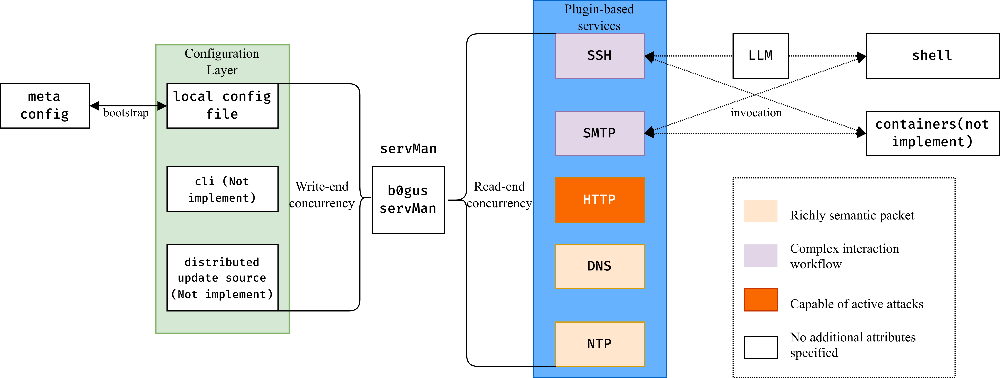

See introductions of b0gus which have been translated into different languages below.

- [中文](readmes/zh_cn.md)

## TL;DR
b0gus is a Low-interactive, Configuration-Directed golang Honeypot.



### Capacities
Currently, **bogus** is still under active development stage.
Some business functions are not yet fully developed.
b0gus supports to deploy _SSH_, _HTTP_, _SMTP_, and _NTP_ as a functional honeypot.
'Functional' here means that you can assign non-privilege port number,
fetch records (etc. `attackers' IP,`, `user name`, `passwords`, `public keys`,
`ssh versions`, `accessing time`, `attacking pattern`)
from interactions ~~and reload the configuration of services in real time~~.

### Build & Deployment
The main external dependencies required for building are
[antlr4](https://github.com/antlr/antlr4) and
[protoc-gen-go](https://pkg.go.dev/google.golang.org/protobuf).
The former requires a local Java interpreter (Openjdk-25-jdk). After local compilation,
it is written into environment variables via scripts to support AST parsing and
traversal for domain-specific languages.

For the latter in a Linux environment on Debian-based distributions,
compilation support can be obtained directly by running `sudo apt install -y protoc-gen-go`.
It is mainly used to store specific data into the database in Protobuf format.
Refer to the build stage defined in [buildImg.Dockerfile](../buildImg.Dockerfile) for both dependencies.

Once both dependencies are confirmed available,
run `make release` in the project directory to compile the production binary executable.
If the dependencies are missing, the build process will not modify multiple precompiled code files
embedded in the project, and will directly compile using the existing precompiled versions.
For cross-compilation, the build parameters `Arch` and `osType` need to be specified in advance.
To deploy b0gus locally, ensure the host runs a Linux system with an available database backend.
PostgreSQL is recommended as the first choice for distributed backup capabilities.

Local installation and configuration as a user-level service are not supported for the time being.

### Contribution
1. Fork this repository.
2. Create a branch named _feat-xxx_ based on the dev branch using the command:
   `git checkout -b feat-xxx`. Here, `xxx` stands for the new feature you intend to implement
   for an existing issue or missing functionality.
3. When committing your changes, use standard conventional commit prefixes such as _feat, chore, add, del_,
   to clearly indicate feature additions or code removals. Also specify the main modified files and
   a brief description of your changes in the commit message.
4. Once you confirm your implementation is logically correct and runs stably in your local environment
   (i.e. free of logical bugs, race conditions, memory leaks, out-of-bounds access and other abnormal behaviors), 
   or you have added corresponding unit tests under diff\_tests and 
   all tests for your new feature pass completely, you may submit a Pull Request from your branch.
   Meanwhile, before submitting a merge request, **you need to ensure that all commits within the request are verified**.
   After code review and further evaluation, your branch will be merged, 
   and you will become a contributor to b0gus.
5. Before submitting any pull request, remember to include your information in the [author list]](../AUTHORS).

#### Code Quality Guidelines

This repository enforces restrictive rules for all code written herein:
1. Within a single function, **indentation shall not exceed $4$ levels** in principle,
   the line count shall not exceed $100$ lines, and the character count per column shall not exceed $110$.
	1. If indentation inevitably exceeds $4$ levels but is no more than $5$ levels,
	   the total lines (including comments) within that scope shall not exceed $10$ lines.
	2. reject to review or accept the pull request once the indentation level $\ge 6$. 
2. For function signatures/function definitions, the total number of input and
   output parameters shall not exceed $6$. When the definition is excessively long,
   it shall follow the reference formats below.
3. To meet internationalization requirements, **all comments must be written in English**.
   At the same time, provide detailed explanations for any complex and obscure parts.
4. On the premise of complying with the first three constraints,
   please automatically format your implementation code using local lint or
   code formatting tools before creating a branch pull request.
5. Except for automatically generated code implementations and unit test code,
   it is recommended that the number of code lines in each file does not exceed 2000.

```python
from typing import NoReturn

# SCREAMING_SNAKE_CASE for a constant with its declared type
UPPER_CONST_WITH_TYPE_DEF: int = 0

mapper = {
    "a": 0, "b": 1,
    "c": 2, "d": 3,
}
array = [
    0xa, 0xb, 0xc, 0xd, # It is recommended to wrap lines at a fixed column width.
    0xe, 0xf, 0x0, 0x1
]

# name a class via CamelCase
class CamelStruct:
    def __init__(self):
        pass

# name a function or a variable via snake_case
def foo_snake(
    a: int, b: str, # Multiple parameters per line are allowed if the column limit is not exceeded
    c: float, d: tuple[int, int], e: dict
) -> NoReturn:
    # The closing parenthesis, return type, and opening brace (if applicable) of the function are placed on the same line.
    pass
```

```golang
package tmp

func tmpCamel(
    x string, y int,
    z bool, w error,
) (int, error) {
    // define you implementation
    return 0, nil
}
```

```c
// If you need to use C language, the format is as follows.
int fib(int argc, char *argv[]) {
    int a = 1, b = 1, c;
    for (int i = 0; i < 16; i++) {
        // Braces must be retained even for a single line statement
        c = a + b;
        // not recommend to write in one line: a = b, b = c;
        a = b;
        b = c;
    }
    printf("%d", c);
    return 0;
}

static inline
void hello_world(int a1, int a2) { 
    if (a1 < a2) {
        return;
    } else {
        printf("%d", a1);
    }
}

/* definition format of function do_something is also acceptable */

static inline struct abc_def
do_something() {
    struct abc_def res;
    return res;
}

// require alignment. 
static __attribute__((always_inline))
       __attribute__((unused))
void retry(
    int a1, int b1,
    const void* a2, 
    void *b2
);
```


### References
mentioned in code or the documentations.

### License
b0gus is distributed under the terms of the BSD 3-Clause License. See the included file `license` in the root directory of b0gus for more details.

### Todo-list
- if possible, set up [oss-fuzz](https://google.github.io/oss-fuzz/getting-started/new-project-guide/)
- other todos mentioned in the source code
- attempt to run on Windows
