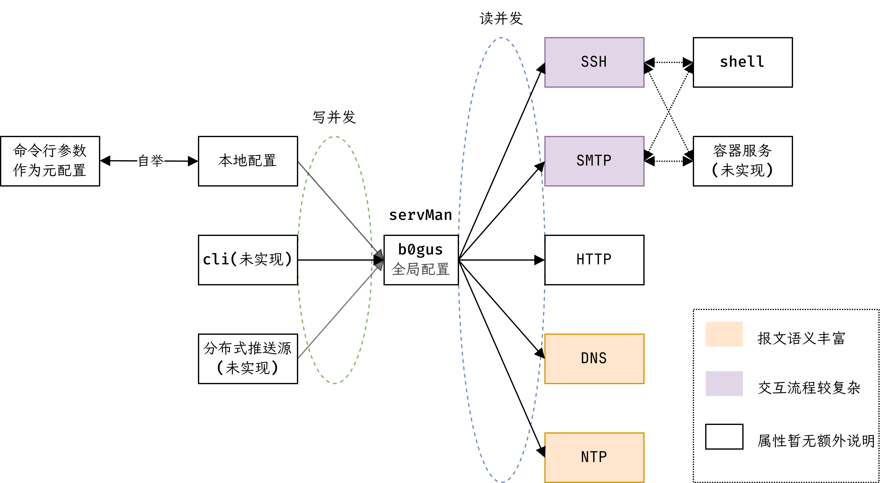

## b0gus
配置导向型蜜罐系统。整体架构见下图。

### 可用功能

目前b0gus仍处在活跃开发的阶段。支持将`SSH`、`HTTP`、`DNS`、`NTP`等服务部署在指定非特权端口并转发到特权端口上作为蜜罐。
可初步记录攻击者IP、证书公钥、攻击时间、弱口令、攻击模式等信息。~~支持热重载除数据库以外的配置信息。~~
后续将使用LLM增强伪装交互能力、使用容器进一步隔离蜜罐，并加入受信域内分布式推送配置、
拟收集各应用程序API以构建主动溯源与关联分析能力等支持。

### TODOs

- 如有可能，配置[oss-fuzz](https://google.github.io/oss-fuzz/getting-started/new-project-guide/)以全天自动化评估潜在的实现缺陷。
- 修完代码内提及的所有todo和fixme。
- 继续完善协议与相关功能的实现。

### 参考在线文档

以及其它于代码内提及的参考。
- [golang.halfiisland.com/community/pkgs/orm/gorm.html#外键](https://golang.halfiisland.com/community/pkgs/orm/gorm.html#%E9%92%A9%E5%AD%90)
- [高校网络信息技术有关文档](https://bg6cq.github.io/ITTS/)
- [Golang 中文学习文档 > MongoDB](https://golang.halfiisland.com/community/database/MongoDB.html)
- [Debian 打包教程](https://www.debian.org/doc/manuals/packaging-tutorial/packaging-tutorial.zh_CN.pdf)

### 关于许可证
b0gus按3条款BSD许可证分发。中译文具体如下。

版权所有© 2025-?, <kisfg@hotmail.com>和<jajune257@gmail.com>。
保留所有权利。

允许以源代码和二进制形式再分发和使用，无论是否修改，但须满足以下条件

1. 源代码的再分发必须保留上述版权声明、本条件列表和以下免责声明。

2. 二进制形式的再分发必须在随分发提供的文档和/或其他材料中复制上述版权声明、本条件列表和以下免责声明。

3. 事先未获取明确书面许可，不得使用版权所有者的名称或其贡献者的名称来认可或推广源自本软件的产品。

本软件由版权所有者和贡献者“按原样”提供，并不提供任何明示或暗示的保证，包括但不限于对适销性和特定用途适用性的暗示保证。
在任何情况下，版权所有者或贡献者均不对任何直接、间接、附带、特殊、惩戒性或后果性损害（包括但不限于采购替代商品或服务；
损失使用、数据或利润；或业务中断）承担责任，无论其由何种原因引起，以及基于何种责任理论，
无论是合同、严格责任还是侵权行为（包括疏忽或其他），以任何方式因使用本软件而引起，即使已被告知可能发生此类损害。
