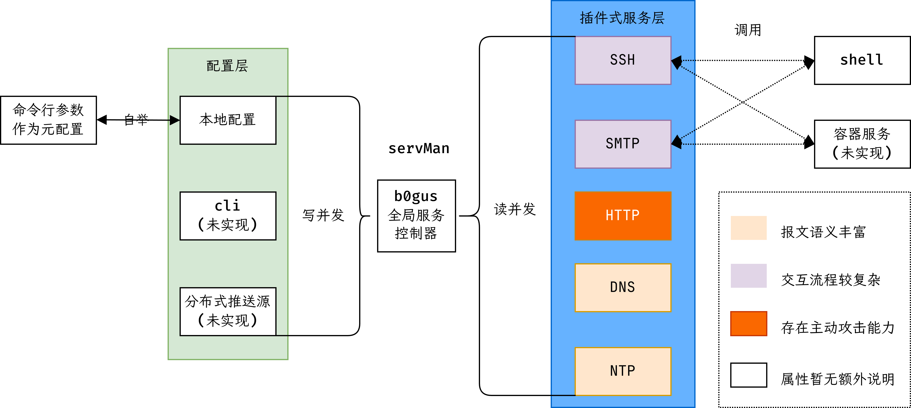

## b0gus
使用golang编写的配置导向型蜜罐系统。整体架构见下图。



### 可用功能

目前b0gus仍处在活跃开发的阶段。支持将`SSH`、`HTTP`、`DNS`、`NTP`等服务部署在指定非特权端口并转发到特权端口上作为蜜罐。
可初步记录攻击者IP、证书公钥、攻击时间、弱口令、攻击模式等信息。~~支持热重载除数据库以外的配置信息。~~
后续将使用LLM增强伪装交互能力、使用容器进一步隔离蜜罐，并加入受信域内分布式推送配置、
拟收集各应用程序API以构建主动溯源与关联分析能力等支持。

### 关于构建与部署

构建所需主要外部依赖是[antlr4](https://github.com/antlr/antlr4)和
[protoc-gen-go](https://pkg.go.dev/google.golang.org/protobuf)。
前者需要本地具有Java解释器(Openjdk-25-jdk)，且在本地编译后以脚本形式写入到环境变量中，
从而便于提供针对领域特定语言的AST解析与遍历能力。

后者如果是处在Linux环境，在Debian系发行版下，可直接通过`sudo apt install -y protoc-gen-go`而获取到编译支持。
主要用于将特定数据以protobuf的形式保存到数据库内。 两者可参考[buildImg.Dockerfile](../../buildImg.Dockerfile)内的构建阶段。

当确定两个依赖存在后，于工程目录下，通过`make release`即可编译出生产环境下的二进制文件。
当依赖不存在时，则编译流程则不会对预先编译于项目内的多个代码文件做出修改，而是直接采用预先编译的版本而直接尝试编译。

对于交叉编译，则还需要预先指定编译参数`Arch`和`osType`。

本地如要部署b0gus，首先**需确保主机是linux系统**，有可用的数据库后端。推荐首选PostgreSQL以获得分布式备份能力。

此外，配置默认由`configs/config.toml`读取，**需参考`configs/example.toml`的写法来正确定义需要启用的服务配置**。
类似地，工程主目录下提供有调用LLM翻译locale文件的[python脚本](../../auto_translator.py)。
当有意修改并尝试运行该脚本时，也需要参考`example-translator-conf.toml`内的定义来提供其配置文件`translator-conf.toml`。

暂不支持本地安装与配置为用户级服务。

### 贡献方式
1. Fork这个仓库。
2. 在dev分支基础上建`feat-xxx`分支，即：`git checkout -b feat-xxx`。此处`xxx`指代你为某个问题或者缺乏的实现所要新加的功能。
3. 提交时用feat, chore, add, del等领域内可读的缩略注明功能性新增或裁剪语句，并附着最主要修改的代码文件和修改上的说明。
4. 当你认为你的实现没有逻辑错误并且在事实上能让代码在你的本地环境中正常运行
  （即功能不产生逻辑错误、并发风险、内存溢出或越界读写等异常行为），
   或者在diff\_tests下新增单元测试并能确保针对你所新增的功能能完全通过测试后，你可以发起你的分支拉取请求。
    同时，在发起合并请求之前，**你需确保请求内所有提交都是受验证的(verified)**。
   经代码审阅和额外评测后即可合并你的代码，同时你将成为b0gus的贡献者。
5. 提交任何PR前，记得将你的信息填入[作者列表](../AUTHORS)中.

#### 关于代码质量
本仓库内对所编写代码存在限制性要求：
1. 单个函数内，**缩进在原则上不应超过 $4$ 层**，且行数不应超过 $100$ 行，每列字符不应超过 $110$ 个。
   1. 如果不可避免超过 $4$层 而小于等于 $5$ 层，则该层内连同注释的行数，不应连续超过 $10$ 行。
   2. 拒绝评阅与通过达到或超过$6$层嵌套的实现逻辑。
2. 对于函数签名/函数定义，传入与传出参数的总和不应超过 $6$ 个。且当定义过长时，应使用下列参考格式而完成你的实现。
3. 为满足国际化需要，**代码内只接受英文注释**。同时，请详细解释其中的复杂难解之处。
4. 在满足前四条约束的情形下，请在发起分支拉取请求前，用本地的lint或代码格式检查器自动格式化你的实现代码。
5. 除自动化生成的代码实现以及单元测试代码，每个文件的代码行建议不超过 $2000$ 行。
6. 如有必要，可补充文档说明。
```python3
# 此处仅作为参考格式说明，故注释使用中文。
from typing import NoReturn

# 常量使用大写与下划线作为分词间隔
UPPER_CONST_WITH_TYPE_DEF: int = 0

mapper = {
    "a": 0, "b": 1,
    "c": 2, "d": 3,
}
array = [
    0xa, 0xb, 0xc, 0xd, # 请按照固定长度换行
    0xe, 0xf, 0x0, 0x1
]

# 类使用驼峰命名
class CamelStruct:
    def __init__(self):
        pass

# 函数与变量使用蛇形命名
def foo_snake(
    a: int, b: str, # 在未超出列数要求的情形下，允许单行内出现多个参数
    c: float, d: tuple[int, int, str], 
    e: dict[int, str] 
) -> NoReturn: # 声明结束时，右括号需与返回对象位于新行
    pass
```
```golang
package tmp

func tmpCamel(
    x string, y int,
    z bool, w error,
) (int, error) {
    return 0, nil
}
```
```c
// 如需使用C语言，格式如下。
int fib(int argc, char *argv[]) {
    int a = 1, b = 1, c;
    for (int i = 0; i < 16; i++) {
        // 即使只有一行，也需要保留大括号
        c = a + b;
        // 不推荐写在一行 a = b, b = c;
        a = b;
        b = c;
    }
    printf("%d", c);
    return 0;
}
static inline
void hello_world(int a1, int a2) { 
    if (a1 < a2) {
        return;
    } else {
        printf("%d", a1);
    }
}

/* 采用此种方式书写 `do_something` 函数亦可 */ 

static inline struct abc_def
do_something() {
    struct abc_def res;
    return res;
}

// 属性需要对齐
static __attribute__((always_inline))
       __attribute__((unused))
void retry(
    int a1, int b1,
    const void* a2, 
    void *b2
);
```


### 参考在线文档
以及其它于代码内提及的参考。
- [golang.halfiisland.com/community/pkgs/orm/gorm.html#外键](https://golang.halfiisland.com/community/pkgs/orm/gorm.html#%E9%92%A9%E5%AD%90)
- [高校网络信息技术有关文档](https://bg6cq.github.io/ITTS/)
- [Golang 中文学习文档 > MongoDB](https://golang.halfiisland.com/community/database/MongoDB.html)
- [Debian 打包教程](https://www.debian.org/doc/manuals/packaging-tutorial/packaging-tutorial.zh_CN.pdf)

### 关于许可证
b0gus按三条款BSD许可证分发。中译文具体如下。

版权所有© 2025年，<kisfg@hotmail.com>与<jajune257@gmail.com>以及其余对b0gus产出贡献的可敬贡献者。

允许以源代码和二进制形式再分发和使用，无论是否修改，但须满足以下条件

1. 源代码的再分发必须保留上述版权声明、本条件列表和以下免责声明。

2. 二进制形式的再分发必须在随分发提供的文档和/或其他材料中复制上述版权声明、本条件列表和以下免责声明。

3. 事先未获取明确书面许可，不得使用版权所有者的名称或其贡献者的名称来认可或推广源自本软件的产品。

本软件由版权所有者和贡献者“按原样”提供，并不提供任何明示或暗示的保证，包括但不限于对适销性和特定用途适用性的暗示保证。
在任何情况下，版权所有者或贡献者均不对任何直接、间接、附带、特殊、惩戒性或后果性损害（包括但不限于采购替代商品或服务；
损失使用、数据或利润；或业务中断）承担责任，无论其由何种原因引起，以及基于何种责任理论，
无论是合同、严格责任还是侵权行为（包括疏忽或其他），以任何方式因使用本软件而引起，即使已被告知可能发生此类损害。

### TODOs
- 如有可能，配置[oss-fuzz](https://google.github.io/oss-fuzz/getting-started/new-project-guide/)以全天自动化评估潜在的实现缺陷。
- 修完代码内提及的所有todo和fixme。
- 继续完善协议与相关功能的实现。
